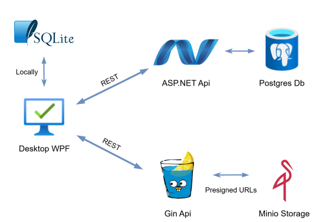

# RateMe

## 📝 Overview
Desktop app for reviewing grades and academic performance<br>
Provides RESTful api and S3-compatible service as backend

## 🚀 Stack
- C# 🎵
- ASP.NET 🌐
- PostgreSQL 🐘
- WPF 🖼️
- SQLite 🕊️
- Go 🐹
- Gin 🍹
- MinIO ☁️
- Docker 🐳

## ✨ Core Features
- 📙 CRUD for users, subjects and grading components (ASP.NET, Postgres, SQLite) 
- 📸 CRUD for profile pictures (Gin, Minio)
- 🙌 Convenient desktop UI (WPF)
- 🎈 Serverless mode support (SQLite)
- 🔒 User authentication & authorization
- ✍️ Subjects and components can be automatically parsed from the website 


## 🏗️ Architecture



## 📥 Download desktop app

You can download the latest version of the app (windows only) from the
[releases](https://github.com/M0s1ck/RateMe/releases) page.

## 🛠️ Backend setup with Docker Compose
Follow these steps to get the backend up and running using Docker Compose:

**1️⃣ Clone the repository**

```sh
git clone https://github.com/M0s1ck/RateMe
cd RateMe
```

**2️⃣ Copy the example environment file**

```sh
copy .env.example .env
```

Edit the .env file to configure environment variables (e.g. database credentials, secrets).

**3️⃣ Build and start the services**

```sh
docker-compose up --build
```

**4️⃣ Done 🎉**

Asp.net api swagger will be available at <br>
http://localhost:8080/api/v1/swagger-ui/index.html <br>
<br>
S3 service api swagger will be available at <br> 
http://localhost:8800/api/v1/swagger-ui/index.html